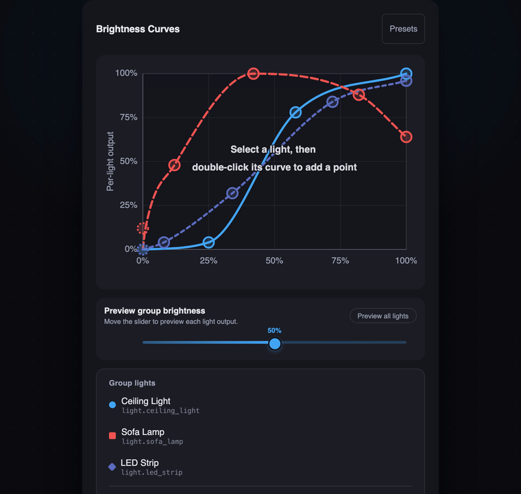

# Lightener Studio

[![GitHub Release][releases-shield]][releases]
[![hacs][hacsbadge]][hacs]

## Make every light in the room feel right.

Shape how each light responds to brightness — by hand, previewed live on your real lights. Save when it looks right.



Built on [Lightener](https://github.com/fredck/lightener). Everything upstream included, unchanged.

**[Try the live demo](https://florianhorner.github.io/lightener-studio/)** — no install needed.


## What it does

Lightener lets one control drive many lights at once. Lightener Studio adds the missing piece: a visual editor for *how* each light reacts as you turn the group up and down. Pull the accent lamp down so it stays a soft glow at low levels, let the ceiling lights ramp faster, give the corner lamp a dim floor so it never drops to black. You drag the shape; the room follows. No YAML, no typing number pairs by hand.

## Highlights

- **Drag control points** on smooth curves to shape each light's brightness response.
- **Live light preview** — the Preview button pushes real brightness to your lights while you shape, and the scrubber pushes live brightness too. Lights restore automatically when you stop.
- **Brightness scrubber with graph sync** — drag to preview every light's output at any level; a vertical indicator and per-curve dots track on the graph.
- **One-click presets** — Linear, Dim accent, Late starter, Night mode, applied to one light or all, fully undoable.
- **Sidebar panel** — pick a Lightener group and edit curves without adding a dashboard card first.
- **Colorblind-accessible** — dash patterns and shape markers distinguish curves without relying on color.
- **Keyboard and mobile friendly** — arrow keys on the scrubber, Ctrl+S to save, Ctrl+Z to undo, 44px touch targets, long-press to delete.
- **Scales from 2 to 20+ lights** — legend rows and curve labels truncate cleanly at any width; non-admins see curves read-only.

## Installing

Requires Home Assistant 2024.2.0 or newer.

[](https://my.home-assistant.io/redirect/hacs_repository/?owner=florianhorner&repository=lightener-studio&category=integration)

Or add it manually:

1. In HACS, go to the three-dot menu → **Custom repositories**
2. Add `florianhorner/lightener-studio` as an Integration
3. Search for "Lightener Studio" and install it
4. Restart Home Assistant
5. Add a card to your dashboard:

```yaml
type: custom:lightener-curve-card
entity: light.your_lightener_device
```

Removing Lightener Studio restores stock Lightener — every device and automation stays exactly as it was, untouched.

## Sidebar panel

The integration also registers a **Lightener Editor** sidebar panel at `/lightener-editor`. Use it to pick a Lightener group and edit curves without adding a dashboard card first.

## WebSocket API

- `lightener/get_curves` — read brightness configs (all authenticated users)
- `lightener/save_curves` — write brightness configs (admin only)
- `lightener/list_entities` — list available Lightener entities (used by the sidebar panel)

## Documentation

- [CHANGELOG.md](CHANGELOG.md) — release history
- [CONTRIBUTING.md](CONTRIBUTING.md) — local setup, tooling, and workflow
- [SECURITY.md](SECURITY.md) — vulnerability reporting policy
- [DESIGN.md](DESIGN.md) — UI tokens, patterns, and accessibility baseline
- [docs/TROUBLESHOOTING.md](docs/TROUBLESHOOTING.md) — upgrade and caching recovery guide

## Local Development

```sh
scripts/setup-python   # Python venv + deps
scripts/test-python    # backend pytest
```

See [CONTRIBUTING.md](CONTRIBUTING.md) for the full workflow including `scripts/ha-sync` for direct deployment to a test HA instance.

[hacs]: https://github.com/hacs/integration
[hacsbadge]: https://img.shields.io/badge/HACS-Custom-41BDF5.svg?style=for-the-badge

[releases-shield]: https://img.shields.io/github/release/florianhorner/lightener-studio.svg?style=for-the-badge&include_prereleases
[releases]: https://github.com/florianhorner/lightener-studio/releases
